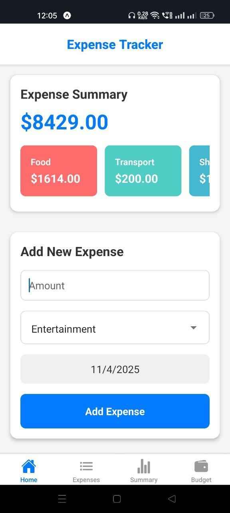
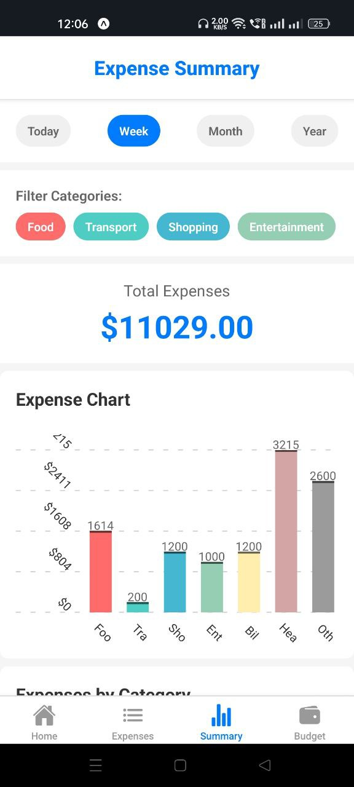
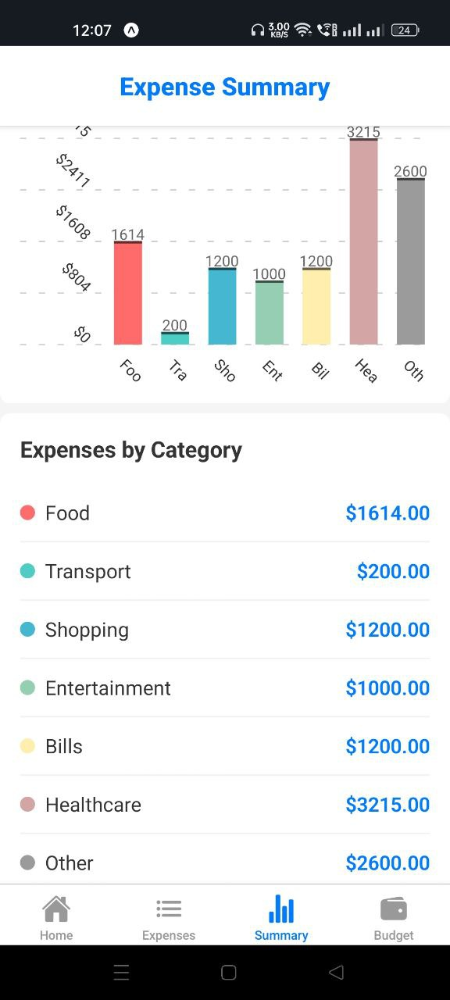
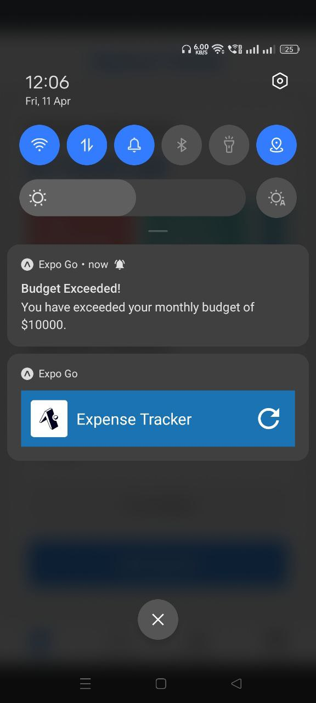

# 📱 Personal Expense Tracker

An elegant, fully responsive **React Native** mobile application designed to streamline the tracking of personal financial expenditures. Built with scalability in mind, it provides a seamless user experience across Android and iOS platforms using **Expo**.

<p align="center">
  
</p>

---

## 🌟 Key Features

- 💸 Add expenses with amount, category & timestamp  
- 📊 Real-time summary breakdown by category  
- 📆 Chronologically sorted expense log  
- 🖌️ Modern, intuitive, and responsive UI  
- 📱 Cross-platform compatibility via **Expo SDK**

---

## 🛠️ Tech Stack

<p align="center">
  
  
  
  
  
  
</p>

---

## 🚀 Getting Started

### 📥 1. Clone Repository

```bash
git clone https://github.com/vaibhavk10/Expense-Tracker.git
cd Expense-Tracker
```

### 📦 2. Install Dependencies

```bash
npm install
```

### 🔧 3. Launch Development Server

```bash
npx expo start
```

### 📱 4. Run the App

- Press `a` – Android Emulator  
- Press `i` – iOS Simulator (macOS only)  
- Or scan QR via **Expo Go** on mobile

---

<h2>📸 Screenshots</h2>

<table>
  <tr>
    <th>Home Screen</th>
    <th>Expenses</th>
    <th>Summary</th>
  </tr>
  <tr>
    <td></td>
    <td></td>
    <td></td>
  </tr>
  <tr>
    <th>Summary detail</th>
    <th>Budget</th>
    <th>Notification</th>
  </tr>
  <tr>
    <td></td>
    <td></td>
    <td></td>
  </tr>
</table>

<hr>
---

## 📜 License

Distributed under the **MIT License**. See [`LICENSE`](LICENSE) for details.

---

## 👨‍💻 Author

Crafted with precision and passion by [**Vaibhav Kumawat**](https://github.com/vaibhavk10)
